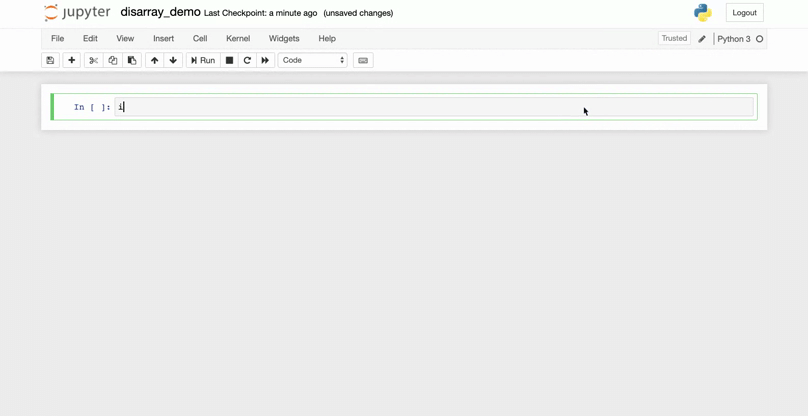

# disarray
[](https://pepy.tech/project/disarray)
[](https://pepy.tech/project/disarray/month)
[](https://travis-ci.com/arvkevi/disarray)
[](https://codecov.io/gh/arvkevi/disarray)

`disarray` calculates metrics derived from a confusion matrix and makes them directly accessible from a pandas DataFrame.



If you are already using [`pandas`](https://pandas.pydata.org/), then `disarray` is easy to use, simply import `disarray`:
 ```python
import pandas as pd

df = pd.DataFrame([[18, 1], [0, 1]])

import disarray

df.da.sensitivity
0    0.947368
1    1.000000
dtype: float64
```

## Table of contents
- [Installation](#installation)
- [Usage](#usage)
    * [binary classification](#binary-classification)
    * [class counts](#class-counts)
    * [export metrics](#export-metrics)
    * [multi-class classification](#multi-class-classification)
    * [supported metrics](#supported-metrics)
- [Why disarray](#why-disarray?)
- [Contributing](#contributing)

## Installation
**Install using pip**
```bash
$ pip install disarray
```

**Clone from GitHub**
```bash
$ git clone https://github.com/arvkevi/disarray.git
$ python setup.py install
```

## Usage
The `disarray` package is intended to be used similar to a `pandas` attribute or method. `disarray` is registered as 
a `pandas` extension under `da`. For a DataFrame named `df`, access the library using `df.da.`.


### Binary Classification
To understand the input and usage for `disarray`, build an example confusion matrix for a **binary classification**
 problem from scratch with `scikit-learn`.   
(You can install the packages you need to run the demo with: `pip install -r requirements.demo.txt`)

```python
from sklearn import svm, datasets
from sklearn.model_selection import train_test_split
from sklearn.metrics import confusion_matrix
# Generate a random binary classification dataset
X, y = datasets.make_classification(n_classes=2, random_state=42)
X_train, X_test, y_train, y_test = train_test_split(X, y, random_state=42)
# fit and predict an SVM
classifier = svm.SVC(kernel='linear', C=0.01)
y_pred = classifier.fit(X_train, y_train).predict(X_test)

cm = confusion_matrix(y_test, y_pred)
print(cm)
[[13  2]
 [ 0 10]]
```

Using `disarray` is as easy as importing it and instantiating a DataFrame object from a **square** array of **positive** integers.

```python
import disarray
import pandas as pd

df = pd.DataFrame(cm)
# access metrics for each class by index
print(df.da.precision[1])
0.83
```

### Class Counts
`disarray` stores per-class counts of true positives, false positives, false negatives, and true negatives. Each of these are stored as capitalized abbreviations, `TP`, `FP`, `FN`, and `TN`.

```python
df.da.TP
```
```python
0    13
1    10
dtype: int64
```

### Export Metrics
Use `df.da.export_metrics()` to store and/or visualize many common performance metrics in a new `pandas` DataFrame 
object. Use the `metrics_to_include=` argument to pass a list of metrics defined in `disarray/metrics.py` (default is 
to use `__all_metrics__`).

```python
df.da.export_metrics(metrics_to_include=['precision', 'recall', 'f1'])
```
|           |        0 |        1 |   micro-average |
|-----------|----------|----------|-----------------|
| precision | 1.0      | 0.833333 |            0.92 |
| recall    | 0.866667 | 1.0      |            0.92 |
| f1        | 0.928571 | 0.909091 |            0.92 |


### Multi-Class Classification
`disarray` works with multi-class classification confusion matrices also. Try it out on the iris dataset. Notice, the
 DataFrame is instantiated with an `index` and `columns` here, but it is not required.

```python
# load the iris dataset
iris = datasets.load_iris()
X = iris.data
y = iris.target
class_names = iris.target_names
# split the training and testing data
X_train, X_test, y_train, y_test = train_test_split(X, y, random_state=0)
# train and fit a SVM
classifier = svm.SVC(kernel='linear', C=0.01)
y_pred = classifier.fit(X_train, y_train).predict(X_test)
cm = confusion_matrix(y_test, y_pred)

# Instantiate the confusion matrix DataFrame with index and columns
df = pd.DataFrame(cm, index=class_names, columns=class_names)
print(df)
```
|            |   setosa |   versicolor |   virginica |
|------------|----------|--------------|-------------|
| setosa     |       13 |            0 |           0 |
| versicolor |        0 |           10 |           6 |
| virginica  |        0 |            0 |           9 |

`disarray` can provide per-class metrics:

```python
df.da.sensitivity
```
```python
setosa        1.000
versicolor    0.625
virginica     1.000
dtype: float64
```
In a familiar fashion, one of the classes can be accessed with bracket indexing.

```python
df.da.sensitivity['setosa']
```
```python
1.0
```
Currently, a [micro-average](https://datascience.stackexchange.com/a/24051/16855) is supported for both binary and
 multi-class classification confusion matrices. (Although it only makes sense in the multi-class case).
```python
df.da.micro_sensitivity
```
```python
0.8421052631578947
```
Finally, a DataFrame can be exported with selected metrics.
```python
df.da.export_metrics(metrics_to_include=['sensitivity', 'specificity', 'f1'])
```

|             |   setosa |   versicolor |   virginica |   micro-average |
|-------------|----------|--------------|-------------|-----------------|
| sensitivity |      1.0 |     0.625    |    1.0      |        0.842105 |
| specificity |      1.0 |     1.0      |    0.793103 |        0.921053 |
| f1          |      1.0 |     0.769231 |    0.75     |        0.842105 |

### Supported Metrics
```python
'accuracy',
'f1',
'false_discovery_rate',
'false_negative_rate',
'false_positive_rate',
'negative_predictive_value',
'positive_predictive_value',
'precision',
'recall',
'sensitivity',
'specificity',
'true_negative_rate',
'true_positive_rate',
```
As well as micro-averages for each of these, accessible via `df.da.micro_recall`, for example.

## Why disarray?

Working with a [confusion matrix](https://en.wikipedia.org/wiki/Confusion_matrix) is common in data science projects. It is useful to have performance metrics available directly from [pandas](https://pandas.pydata.org/) DataFrames. 
 
Since `pandas` version `0.23.0`, users can easily
[register custom accessors](https://pandas.pydata.org/pandas-docs/stable/development/extending.html#extending-pandas),
 which is how `disarray` is implemented.

## Contributing

Contributions are welcome, please refer to [CONTRIBUTING](https://github.com/arvkevi/disarray/blob/master/CONTRIBUTING.md) 
to learn more about how to contribute.
